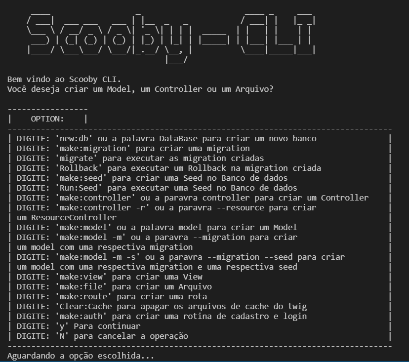

# ScoobyPHP

A simple framework for small projects, studies, and first contact with architecture **MVC**

## Getting Started

These instructions will get you a copy of the project up and running on your local machine for development and testing purposes. See deployment for notes on how to deploy the project on a live system.

### Prerequisites

* NPM
* PHP >= 7.0
* COMPOSER

### Installing

A step by step series of examples that tell you how to get a development env running

#### Run composer

First you need to run the command to install php dependencies via composer

```bash
composer install
```

#### Run npm

Then you need to execute the command to install dependencies of front-end via npm.

```bash
npm install
```

### Open browser on [http://localhost/ScoobyPHP/](http://localhost/ScoobyPHP/). You will see the image below


#### Using CLI by run commands

Often we need to create classes, controllers, views, miscellaneous files, databases, and even complete routines, this part of web development ends up exhausting by code repetition. With that in mind we created a command line tool to help create them, with some commands, you can have a complete application running with database connection, login routine, login, logout, and password recovery all functional. is done through Scooby_CLI, when executing this command in the root of the project, in the terminal will appear a welcome screen with the possible commands.

```bash
php Scooby_CLI.php
```

Before you will see the image below



#### In CLI run

To create, or even connect to an already exisatente database, it is necessary to run the new ***new:db*** in CLI mode

```bash
new:db
```

#### Insert the database name or case the existing database, enter with your user and password db

As stated above, to create or connect a database to your project you need to execute the ***new:db*** command, after executing this command, if a database with the same name already exists, you will be asked The password and user of this same DB, by informing this data you will be being connected with it automatically.

#### If you need a registration, login and password recovery routine

Almost all applications require one of a ***new user registration***, ***login***, ***logout*** and ***password recovery*** routine, thinking about this ScoobyPHP automates the entire process of creating, views, passing the necessary controllers, models, and routes, authenticated and unauthenticated and, the main thing, it's all done by executing just one command in the CLI

run the make:auth command in the application CLI

```bash
make:auth
```

## Skelethon aplication folder

In this session we will take a tour of the folder and file structure of a ScoobyPHP project, see its main features and configuration files.

### App

The App folder is one of the most important folders to the development of an application, since it is there is the structure of models, controllers, views and generics

#### App/Controllers

Folder where all application controllers will be created

#### App/Models

Folder where all application models will be created

#### App/Views

Folder where all application views will be created

##### App/Views/Error

In this folder will be the system error views, such as the already existing error 404 view

##### App/Views/Pages

In this folder are the system pages, such as the existing view home and all others to be created, such as the user registration page, login and etc ...

##### App/Views/Templates

In this folder are the default Scooby PHP templates, with css, js and similar uploads.

### Config

Explain what these tests test and why

#### Config/Cache

Explain what these tests test and why

#### Config/lang

Explain what these tests test and why

### Db

Explain what these tests test and why

#### Db/Migrations

Explain what these tests test and why

#### Db/Seeds

Explain what these tests test and why

### Library

Explain what these tests test and why

#### Library/Core

Explain what these tests test and why

#### Library/Helpers

Explain what these tests test and why

#### Library/Shell

Explain what these tests test and why

##### Library/Shell/Templates

Explain what these tests test and why

### Public

Explain what these tests test and why

#### Public/assets

Explain what these tests test and why

##### Public/assets/css

Explain what these tests test and why

##### Public/assets/img

Explain what these tests test and why

##### Public/assets/js

Explain what these tests test and why

## Controllers

Explain how to run the automated tests for this system

### Basic usage

Explain what these tests test and why

```
Give an example
```

### Create a new controller via code

Explain what these tests test and why

```
Give an example
```

### Generete a new controller via CLI

Explain what these tests test and why

```
Give an example
```

### Using controllers

Explain what these tests test and why

```
Give an example
```

## Models

Add additional notes about how to deploy this on a live system

### Generete a new Model via code

Explain what these tests test and why

```
Give an example
```

### Generete a new Model via CLI

Explain what these tests test and why

```
Give an example
```

### using models

Explain what these tests test and why

```
Give an example
```

## Views

Add additional notes about how to deploy this on a live system

### Generete a new view via code

Explain what these tests test and why

```
Give an example
```

### Generete a new view via CLI

Explain what these tests test and why

```
Give an example
```

### using views

Explain what these tests test and why

```
Give an example
```

## Public

Add additional notes about how to deploy this on a live system

### Generete a new css file via CLI

Explain what these tests test and why

```
Give an example
```

### Generete a new JS file via CLI

Explain what these tests test and why

```
Give an example
```

### Working on css and javascript files

Explain what these tests test and why

```
Give an example
```

## Routers

Add additional notes about how to deploy this on a live system

### Generete a new route via code

Explain what these tests test and why

```
Give an example
```

### Generete a new route via CLI

Explain what these tests test and why

```
Give an example
```

### using routes

Explain what these tests test and why

```
Give an example
```

## Helpers

Add additional notes about how to deploy this on a live system

### Using helpers

Explain what these tests test and why

```
Give an example
```

### Auth

Explain what these tests test and why

```
Give an example
```

### Cookie

Explain what these tests test and why

```
Give an example
```

### Csrf

Explain what these tests test and why

```
Give an example
```

### Email

Explain what these tests test and why

```
Give an example
```

### FlashMessage

Explain what these tests test and why

```
Give an example
```

### Helper

Explain what these tests test and why

```
Give an example
```

### IlluminateDataBase

Explain what these tests test and why

```
Give an example
```

### Login

Explain what these tests test and why

```
Give an example
```

### Minifier

Explain what these tests test and why

```
Give an example
```

### PDODataBase

Explain what these tests test and why

```
Give an example
```

### Redirect

Explain what these tests test and why

```
Give an example
```

### Request

Explain what these tests test and why

```
Give an example
```

### seeders

Explain what these tests test and why

```
Give an example
```

### Session

Explain what these tests test and why

```
Give an example
```

### validation

Explain what these tests test and why

```
Give an example
```

## Database

Add additional notes about how to deploy this on a live system

### Eloquent

Explain what these tests test and why

```
Give an example
```

### Query Builder

Explain what these tests test and why

```
Give an example
```

### Migrations

Explain what these tests test and why

```
Give an example
```

### Seeds

Explain what these tests test and why

```
Give an example
```

## Scooby_CLI

Explain what these tests test and why

### Start Scooby_CLI

Explain what these tests test and why

```
Give an example
```

### Commands

Explain what these tests test and why

```
Give an example
```

## Built With

### Back-End

* [Composer](http://www.dropwizard.io/1.0.2/docs/) - The web framework used
* [PHP](https://rometools.github.io/rome/) - Used to generate RSS Feeds
* [Twig](https://rometools.github.io/rome/) - Used to generate RSS Feeds
* [Illuminate/Database](https://rometools.github.io/rome/) - Used to generate RSS Feeds
* [Larapack/dd](https://rometools.github.io/rome/) - Used to generate RSS Feeds
* [Matthiasmullie/minify](https://rometools.github.io/rome/) - Used to generate RSS Feeds
* [Flip/whoops](https://rometools.github.io/rome/) - Used to generate RSS Feeds
* [Robmorgan/phinx](https://rometools.github.io/rome/) - Used to generate RSS Feeds
* [Swiftmailer](https://rometools.github.io/rome/) - Used to generate RSS Feeds
* [dfridrich/php-mime-type](https://rometools.github.io/rome/) - Used to generate RSS Feeds

### Front-End

* [NPM](https://maven.apache.org/) - Dependency Management
* [Materialize-css](https://rometools.github.io/rome/) - Used to generate RSS Feeds
* [SweetAlert-2](https://rometools.github.io/rome/) - Used to generate RSS Feeds
* [IziToast](https://rometools.github.io/rome/) - Used to generate RSS Feeds
* [Animate.css](https://rometools.github.io/rome/) - Used to generate RSS Feeds

## Contributing

Please read [CONTRIBUTING.md](https://gist.github.com/PurpleBooth/b24679402957c63ec426) for details on our code of conduct, and the process for submitting pull requests to us.

## Versioning

We use [Semantic Versioning 2.0.0](http://semver.org/). For the versions available, see the [tags on this repository](https://github.com/terriani/ScoobyPHP).

## Authors

* **Vinicius Terriani**  - [Terriani](https://github.com/Terriani)

See also the list of [contributors](https://github.com/terriani/ScoobyPHP/contributors) who participated in this project.

## License

This project is licensed under the MIT License - see the [LICENSE.md](LICENSE.md) file for details

## Acknowledgments

* Hat tip to anyone whose code was used
* Inspiration
* etc
